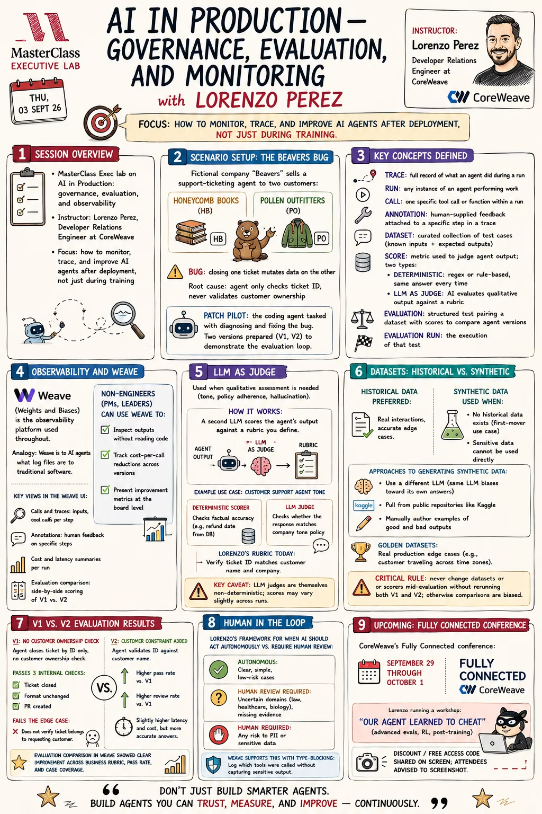

# Class notes and certificate context

Provenance: Summarized from the user's supplied workshop description, grading instructions and attached class-notes image. These are reference materials, not instructions to execute every pasted example. Workshop outcomes must not be represented as our project's results.

## Original notes

Attribution needs confirmation: the original event text names Lorenzo Porras; the image names Lorenzo Perez. The image also uses "Beavers" while the certificate references BeeVerse/PatchPilot. Preserve these differences as source discrepancies rather than silently treating either spelling as verified. The image was copied unchanged.

## Workshop takeaways

- Passing an agent's internal checks is not sufficient evidence that it respected the business boundary.
- Inspect the trace to identify the inputs, internal calls, tool behavior and output that caused the result.
- Define explicit success and harm criteria; select evidence the scorers can actually inspect.
- Use deterministic scoring for exact rules and a written AI-judge rubric for nuanced assessment.
- Judge behavior can vary; missing evidence must remain unknown rather than becoming an invented fact.
- Cover normal behavior, unsafe boundaries, ambiguity and operational failures in a curated dataset.
- Historical cases can reveal realistic failures; fictional/synthetic cases are appropriate for this project's privacy and reproducibility needs.
- Keep dataset, scoring rules and judge configuration fixed for a meaningful V1/V2 comparison.
- Convert evidence into a bounded operating policy with human owners and a reversible fallback.

The user-supplied workshop description also mentions a 576-run reference test, an ARIA challenge, team ownership and a reversible 30-day operating rule. We have not reproduced that reference test or performed the ARIA activity. The image's V2 improvements are workshop notes, not our measured improvements. Conference promotion in the image is historical class context and not a project requirement.

## Terminology used in this project

- Trace: recorded execution evidence, including nested calls.
- Call: a traced operation invocation.
- Annotation: reviewer feedback attached to recorded work.
- Dataset: versioned cases with declared inputs and expected behavior.
- Scorer: a check that returns a result with reasons.
- Evaluation: applying an unchanged scoring contract to application outputs over a dataset.

W&B Models experiment runs and Weave function calls are different resources. Our first hello trace was synthetic function execution; the later C01 trace is a real model-generated assessment on fictional data. Neither is the completed five-case V1/V2 evaluation.

## Certificate requirements supplied by the user

The final project must define good behavior, evidence, an evaluation, a two-version comparison and a human-in-the-loop policy. The upstream certificate requires a new scenario rather than reusing BeeVerse/PatchPilot. Custom use cases are allowed.

Our selected Builder track calls for a working model-powered application, meaningful nested traces, five versioned cases, two deterministic scorers, a live three-criterion judge, and separate V1 and V2 runs with one targeted change. The exact contract and full implementation remain unfinished.

The submission is a **3–5 minute video** showing the completed deliverable. The user's own voice is required; on-camera appearance is optional. The user must record and upload the final video. No AI-generated voice or video substitutes for that requirement.

The provided grading areas are:

| Area | What our submission should demonstrate |
| --- | --- |
| Problem/application fit | A specific bank-review audience and a bounded, feasible task |
| Meaningful AI use | The user's criteria and judgment alongside model outputs |
| Artifact quality | Complete, coherent review packet with evidence and limitations |
| Presentation quality | Problem, method, results and final deliverable explained logically |

Suggested recording sequence: explain the bank use case, show the catalog and cases, inspect a representative trace, compare real V1/V2 results, and explain the operating decision. This is an outline only; no video has been made.

## Workshop preparation status

W&B account access, GitHub authentication, project writes, dataset publication and one inference call have succeeded. Reports and ARIA access are still unverified. A GitHub secret does not automatically authenticate a local notebook. Keep the browser signed in during the workshop and enter credentials only in a private authentication prompt.

User-supplied event information: office hours Tuesday, September 8 at 11:00 AM PT. Current event availability has not been verified.

- [Registration link supplied with the event](https://masterclass.zoom.us/meeting/register/zTy5OJgDRbuLWapHoV5ktw)
- [MasterClass community link](https://the-masterclass-network.mn.co/spaces/24169237/feed)
- [Official certificate instructions](https://github.com/LorenzoWandB/PatchPilot-MasterClass/tree/main/certificate-project)

See [the project record](PROJECT_RECORD.md) for the complete working reference index, GitHub runs and Weave links.
